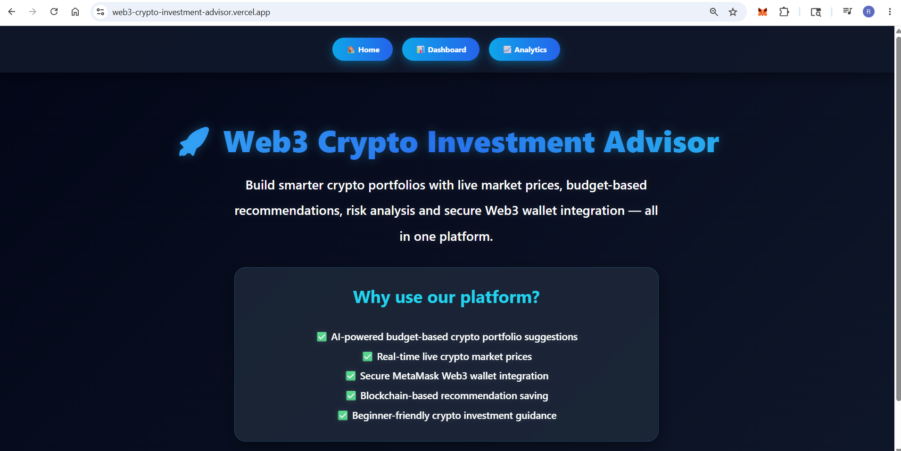
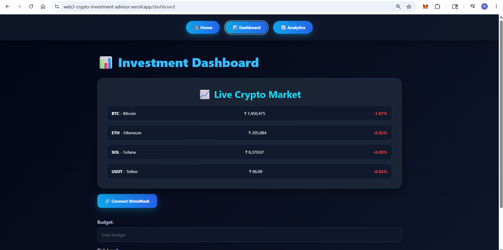
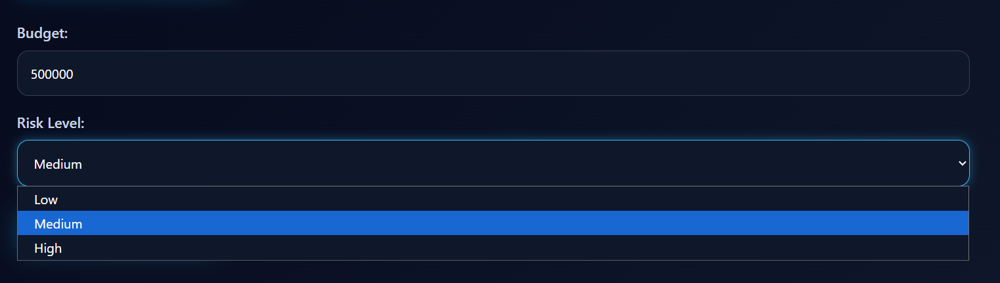
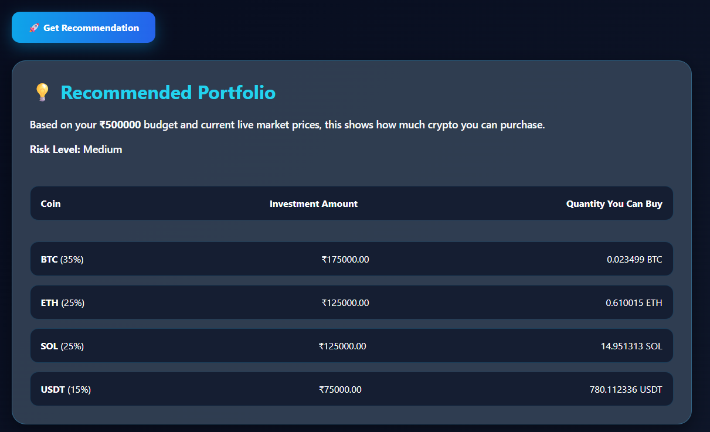
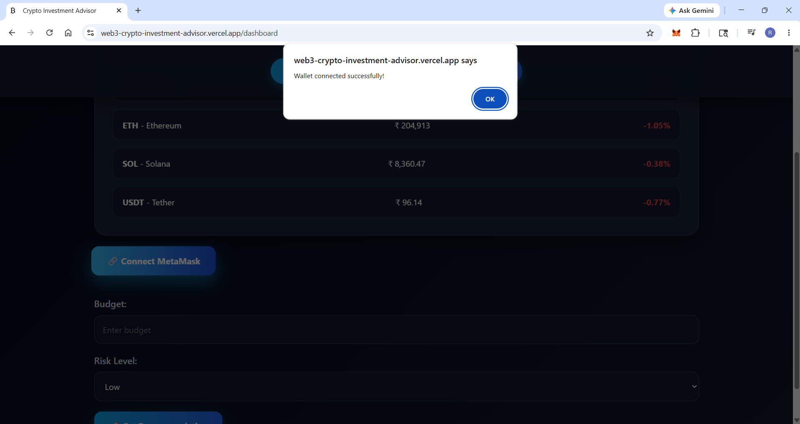
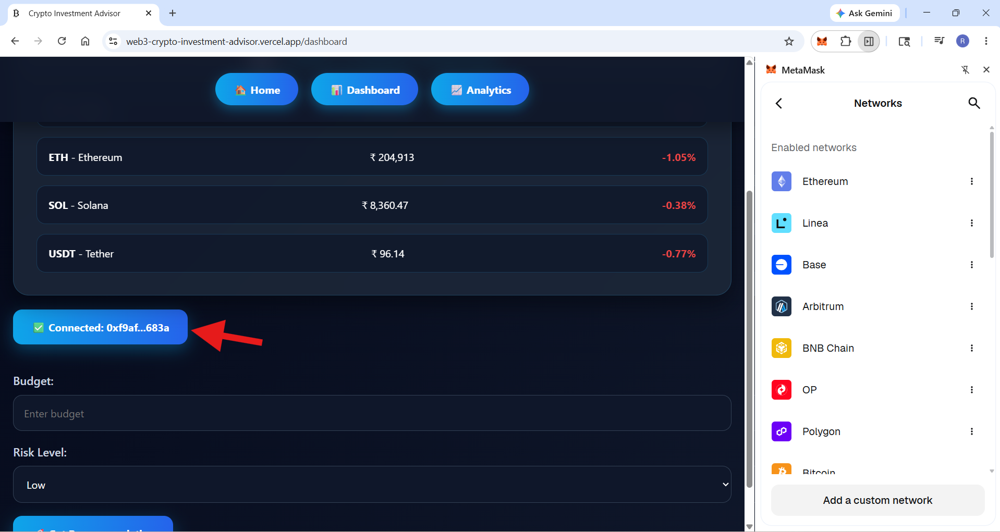
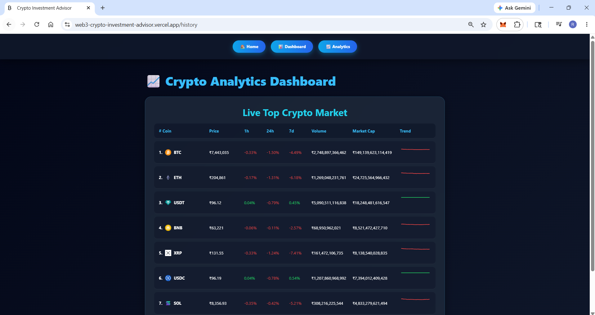

# 🚀 Web3 Crypto Investment Advisor

### AI-Powered Crypto Portfolio Recommendation Platform

**Web3 Crypto Investment Advisor** is a smart crypto investment platform that helps users make better cryptocurrency investment decisions using **real-time market prices, budget-based portfolio recommendations, risk analysis, crypto analytics, and secure MetaMask wallet integration**.

🔗 **Live Web App:** [Web3 Crypto Investment Advisor](https://web3-crypto-investment-advisor.vercel.app/)  
🔗 **LinkedIn:** [Pradnya Naresh Ghodke](https://www.linkedin.com/in/pradnya-ghodke/)

---

# 📌 Problem This Web App Solves

Cryptocurrency investment can be difficult for beginners and even experienced investors because:

- Crypto markets change rapidly every second.
- Users often do not know **which cryptocurrency to invest in based on their budget**.
- Investors face difficulty understanding **risk levels in crypto portfolios**.
- Market analysis data is scattered across different websites and platforms.
- Beginners struggle with secure **Web3 wallet integration and blockchain-based investment tools**.

### Our Solution

**Web3 Crypto Investment Advisor** solves these problems by providing:

✅ Real-time live crypto market prices  
✅ Budget-based portfolio recommendations  
✅ Risk-level investment suggestions  
✅ Crypto analytics dashboard  
✅ Secure MetaMask Web3 wallet integration  
✅ Beginner-friendly investment guidance in one platform  

---

# ✨ Features

- 📊 **Live Crypto Market Dashboard**
- 🤖 **AI-Based Portfolio Recommendations**
- 💰 **Budget-Based Investment Planning**
- ⚠️ **Risk Analysis (Low / Medium / High)**
- 🔐 **MetaMask Wallet Integration**
- 📈 **Crypto Analytics Dashboard**
- 🪙 **Top Cryptocurrency Market Tracking**
- 🌐 **Web3 Blockchain-Based Platform**
- 📱 **Responsive Professional UI**

---

# 🖼️ Project Screenshots

## 🏠 Homepage

---

## 📊 Live Crypto Market Dashboard

---

## ⚠️ Risk Selection Options

---

## 💡 Investment Suggestions

---

## 🔗 MetaMask Wallet Connection

---

## ✅ Wallet Connected

---

## 📈 Crypto Price History Analytics

---

# 🛠️ Tech Stack

### Frontend
- React.js
- HTML5
- CSS3
- JavaScript

### Web3 Integration
- MetaMask
- Ethers.js

### Blockchain
- Hardhat
- Solidity

### APIs
- Live Crypto Market APIs

### Deployment
- Vercel

---

# 🎯 Use Cases

This platform can be used by:

- Beginner crypto investors
- Web3 learners
- Crypto traders
- Blockchain students
- Portfolio planners
- Crypto analytics enthusiasts

---

# 📌 Future Enhancements

- Advanced AI portfolio prediction
- More cryptocurrency support
- Historical graph visualization
- Blockchain transaction saving
- User authentication
- Personalized crypto alerts

---

# 👩‍💻 Developer

**Pradnya Naresh Ghodke**

Connect on LinkedIn:  
[Pradnya Naresh Ghodke](https://www.linkedin.com/in/pradnya-ghodke/)

---

# ⭐ Live Demo

👉 [Click Here to Use Web App](https://web3-crypto-investment-advisor.vercel.app/)
